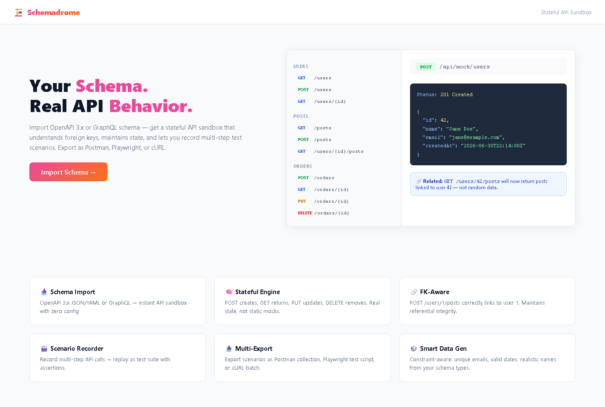

# Schemadrome — Schema-Driven Stateful API Sandbox

[](LICENSE)
[](https://www.typescriptlang.org/)
[](https://nextjs.org/)

Imports OpenAPI 3.x or GraphQL schemas and generates a stateful API sandbox. Resources maintain real relationships — posting to /users/1/posts returns posts linked to user 1, not random data. Record multi-step scenarios and export them as Postman collections or Playwright tests.

## Screenshots

| API Explorer with Sidebar Navigation | Stateful POST Response and FK Links |
|:---:|:---:|
|  |  |

## Features

- Import OpenAPI 3.x (JSON/YAML) or GraphQL schemas
- Stateful mock engine: POST creates resources, GET returns them, DELETE removes them
- Foreign key awareness: related endpoints return linked data, not random mocks
- Scenario recorder: record multi-step API calls, replay with assertions
- Export to Postman collection, Playwright test script, or cURL commands
- Monaco Editor for viewing and editing schemas
- Constraint-aware data generator (unique emails, valid date ranges)

## Quick Start

```bash
git clone https://github.com/adlptv/schemadrome.git
cd schemadrome
pnpm install
pnpm dev
```

Or:
```bash
docker-compose up
```

## Architecture

```
apps/schemadrome/
├── src/app/          # Pages: landing, import, explorer, scenarios, export, settings
│   └── api/          # import, schemas, mock/[...path], scenarios, export, health
├── src/components/   # ApiExplorer, ResponseViewer, ScenarioBuilder, UI primitives
├── src/lib/          # OpenAPI parser, GraphQL parser, state engine, constraint engine (Zod)
├── prisma/           # SQLite: Schema, Endpoint, Scenario, MockState
└── tests/
```

## API

| Method | Endpoint | Purpose |
|--------|----------|---------|
| POST | /api/import | Import an OpenAPI or GraphQL schema |
| GET | /api/schemas | List imported schemas |
| GET/DELETE | /api/schemas/[id] | Get or delete a schema |
| * | /api/mock/[...path] | Stateful mock — full CRUD on schema-defined resources |
| GET/POST | /api/scenarios | List or create test scenarios |
| POST | /api/scenarios/[id]/run | Execute a scenario against the mock |
| GET | /api/export/[id] | Export a scenario as Postman, Playwright, or cURL |
| GET | /api/health | Health check |

## Security

- Zod validation on all routes
- Rate limiting
- Helmet.js headers
- Configurable CORS per sandbox
- Isolated state per session

## License

MIT